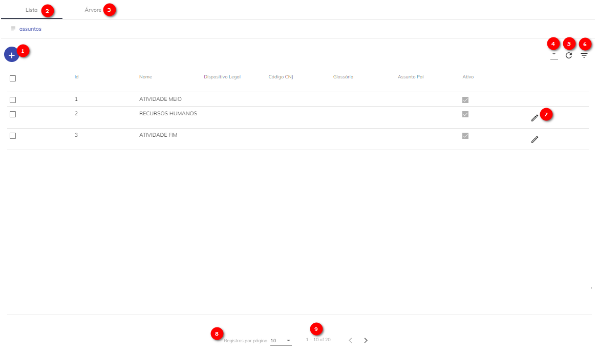
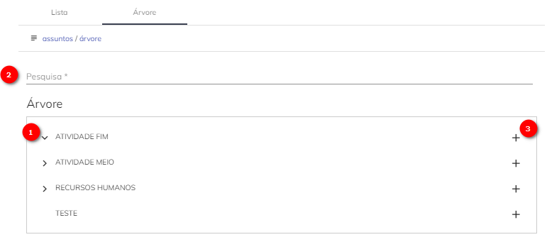
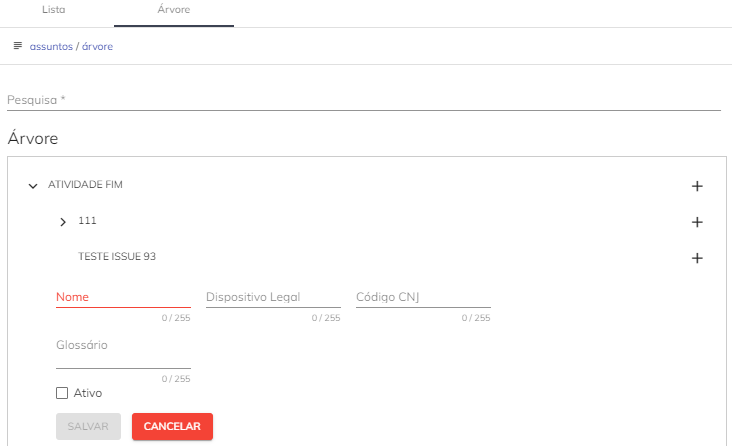

# Assuntos

O campo Assunto servirá para indicar o tema sobre o qual um processo ou documento avulso está tratando.

Todos os processos protocolados devem, obrigatoriamente, conter ao menos um assunto. Este registro possibilitará a extração de relatórios mais fidedignos, além de aumentar o grau de identificação do processo/documento avulso.

O usuário com perfil de Administrador SUPER.br terá as autorizações necessários para cadastrar'' os Assuntos utilizados em seu Órgão de atuação.


## Tela Assuntos No SUPER.br




1) Novo. Utilizado para criar um registro de Assuntos;

2) Aba Lista. Visão em lista dos cadastros de Assuntos;

3) Aba Árvore: Visão que demonstra a árvore de associações entre os Assuntos cadastrados;

4) Colunas. Por esta opção será possível gerenciar as colunas que serão disponibilizadas na tela;

5) Recarregar. Opção permite a atualização dos registros apresentados em tela; 

6) Filtro. Opção possibilita filtrar um intervalo de dados com base em critérios definidos;

7) Editar o cadastro de um Assunto;

8) Opção permite configurar a quantidade de registro a serem mostrados em tela; 

9) Tarja indica a quantidade de páginas relacionadas a consulta em tela. A navegação entre as páginas poderá ser feita por meio do uso das setas disponíveis.

## Como Cadastrar um Assunto

1. Para criação de um Assunto no Super.BR, o usuário deverá acessar o Menu “Assuntos”, existente na visão Administrador, selecionar a guia “Lista” e clicar no botão “Novo”   , localizado na parte superior esquerda da tela.

2. Em seguida, deverá ser preenchido os campos disponíveis no formulário para cadastro de Assunto. 

```Nota
Nota: Todos os campos marcados com * (asterísco) são de preenchimento obrigatório.
```


* **Nome:** campo obrigatório para registro nome do Assunto em questão;

* **Dispositivo Legal:** campo opcional destinado ao registro do dispositivo legal relacionado ao Assunto.

* **Código CNJ:** campo opcional, para registro do código CNJ relacionado ao Assunto, caso exista.

* **Glossário:** campo opcional, utilizado para detalhamento/definição do Assunto em questão. Campo de preenchimento livre, com um limite de 255 caracteres. 

* **Assunto Pai:** campo opcional, utilizado para o cadastro do assunto que servirá como estrutura aglutinadora. 

```{warning}
Dúvida: Este campo é somente utilizado para fins de consumo de ferramentas de BI?
```

* **Ativo:** Flag que indicará se o Assunto está disponível para uso ou não do Usuário.
Caso esteja marcada estará ativa e disponível. Caso contrário, estará inativa e indisponível.

### Aba Árvore




1) Botão para maximizar a árvore de assuntos.

2) Campo para pesquisa de Assunto.

3) Botão utilizado para edição de cadastro de Assunto. 

* Se acionado, permitirá a edição dos campos: Nome, Dispositivo Legal, Código CNJ, Glossário e flag Ativo.

* Este botão ficará disponível em todos os níveis da árvore de assuntos.




