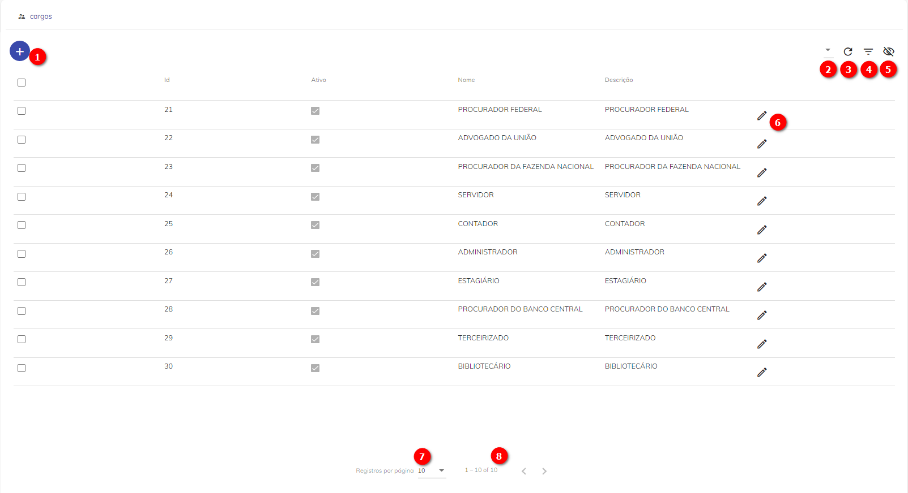
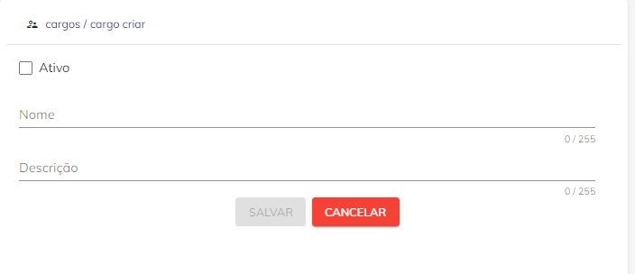

# Cargo


O Cargo é uma classificação atribuída ao servidor-usuário de acordo com as suas funções e qualificações.

Dentro do Super.BR, esse campo baliza o perfil de Usuário e confere reponsabilidades do meio. 

## Tela de Cargos
Com o perfil de Administrador, a tela de Cargos permite visualizar os Cargos cadastrados no Sistema, além de editar os já existentes.



<p style="text-align: center;"> Figura 1 – Tela de Cargos do Super.BR </p> 

Seguem indicadores dos botões na Tela de Cargos (Figura 1):

1)	Criar um registro de novo Cargo;

2)	Colunas. Por esta opção será possível gerenciar as colunas que serão disponibilizadas na tela;

3)	Recarregar. Opção permite a atualização dos registros apresentados em tela;

4)	Filtro. Opção possibilita filtrar um intervalo de dados com base em critérios definidos;

5)	Mostrar inativos. Opção habilita mostra de Cargos Ativos e Inativos;

6)	Editar o cadastro de um Cargo.

7)	Opção permite configurar a quantidade de registros a serem mostrados em tela

8)	Tarja indica a quantidade de páginas relacionadas a consulta em tela. A navegação entre as páginas poderá ser feita por meio do uso das setas disponíveis

## Como Criar um novo Cargo no Super.BR

Para criar um novo Cargo, o usuário com perfil de Administrador de Sistemas deve seguir os seguintes passos  no Super.BR: 

1\.	Acessar a tela de Cargos (Menu Administrador > Cargos) e clicar no botão “Novo”   (indicado como 1 na Tela de Cargos);

2\.	Em seguida, deverá preencher os campos disponíveis no formulário com as informações referentes ao Usuário a ser cadastrado;

```{note}
Nota: Todos os campos marcados com * são de preenchimento obrigatório.
```



<p style="text-align: center;"> Figura 1 – Tela do Formulário</p>


**Ativo:** Flag que indica se o Cargo está Ativo ou Inativo. Cargo Ativo indica se aquele cargo ainda é existente e funcional dentro do Órgão.

**Nome:** Campo obrigatório, destinado ao preenchimento do nome do Cargo;

**Descrição:** Campo obrigatório, destinado ao preenchimento da descrição do Cargo.

3\.	Clicar em “Salvar”.

Após criação do novo Cargo, ele ficará disponível para utilização no cadastro de [Usuários](configuraçao/Usuários.md), na tela de Colaborador. 
