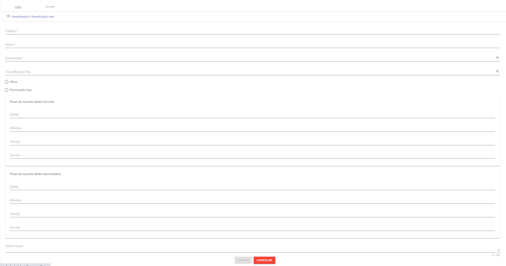

# Classificações

O registro de Classificação é algo primordial no SUPER.GOV.BR 2.0 pois está relacionado a Gestão Arquivística de documentos.

 Gestão documental é o conjunto de procedimentos e operações técnicas referentes à produção, tramitação, uso, avaliação e arquivamento em fase corrente e intermediária, visando a sua eliminação ou recolhimento para guarda permanente.

 A fase corrente está diretamente ligada aos objetivos imediatos que motivaram a produção dos documentos. Entre as características básicas dos documentos nessa fase, podemos destacar a vigência de seu valor primário e a alta frequência de consultas ao seu teor.

 Os documentos na fase intermediária são aqueles cuja frequência de consulta é bem menor, mas que precisam ser mantidos sob guarda devido a questões administrativas, financeiras e legais que justificam a manutenção desse acervo.

 As classificações documentais definem o tempo de guarda e os períodos de Temporalidade e Destinação dos documentos e informações frutos dos fluxos tramitados no SUPER.GOV.BR 2.0.

 O “Código de classificação de documentos de arquivo para a administração pública: atividades-meio” e a “Tabela básica de temporalidade e destinação de documentos de arquivo relativos às atividades-meio da administração pública” aprovados pelo CONARQ são instrumentos fundamentais para a implementação da gestão arquivística de documentos e são utilizados pelo Sistema.

```{warning}
Dúvida: Onde levantar o código arquivístico?
```

## Tela Classificações no SUPER.GOV.BR 2.0


<p style="text-align: center;">Figura 1 – Tela de Classificações SUPP</p>

1) Novo. Utilizado para criar um registro de Classificação;

2) Colunas. Por esta opção será possível gerenciar as colunas que serão disponibilizadas na tela;

3) Recarregar. Opção permite a atualização dos registros apresentados em tela; 

4) Filtro. Opção possibilita filtrar um intervalo de dados com base em critérios definidos;

5) Mostrar Inativos. Permite configura a visão da tela para mostrar, também, registros inativos;

6) Editar o cadastro de uma Classificação;

7) Acessos.

8) Remover. Opção permite à exclusão do registro.

9) Opção permite configurar a quantidade de registro a serem mostrados em tela;

10) Tarja indica a quantidade de páginas relacionadas a consulta em tela. A navegação entre as páginas poderá ser feita por meio do uso das setas disponíveis. 


```{comm}
Dúvida: Para que serve esta funcionalidade? Quando tento acessá-la fica com carregamento infinito;
```


```{Note}
Nota: Ao editar um registro de classificação, o botão Histórico, existente do lado direito de cada campo, ficará disponível para visualização do histórico de alterações do campo, indicando quando o conteúdo foi alterado e quem o alterou.
```


## Como Cadastrar uma Classificação


01\. Para criação de uma nova Classificação no SUPER.br, o usuário deverá acessar o Menu “Classificações”, aba Lista, existente na visão Administrador, e clicar no botão “Novo”   , localizado na parte superior esquerda da tela.

02\. Em seguida, deverá preencher os campos disponíveis no formulário de cadastro.
```{Note}
Nota: Todos os campos marcados com * são de preenchimento obrigatório.
```


<p style="text-align: center;"> Figura 2 - Classificações - Tela do Formulário </p> 


* **Código:** Campo obrigatório destinado ao cadastro do código do Assunto da classificação arquivística definida pelo CONARQ.

* **Nome:** Campo obrigatório destinado ao cadastro do nome/qualificação do assunto arquivístico definido pelo CONARQ.

* **Descrição:** Campo obrigatório destinado a inclusão da descrição da classificação arquivística.
```{Note}
Nota: Os campos “Nome” e “Descrição” são de livre preenchimento, com limitação de 255 caracteres.
```
* **Classificação Pai:** campo opcional utilizado para associação do assunto a ser cadastrado com ou outro assunto de hierarquia superior. 

```{Note}
Nota: Tais associações irão definir a árvore de Classificações do SUPER.br. 
```
* **Ativo:** Flag que indicará se o registro em questão está disponível para uso ou não. Caso esteja marcada estará ativa e disponível. Caso contrário, estará inativa e indisponível.
Classificação Ativa é aquela que continua válida, disponível e possivelmente em uso para realizar classificações de processos. 

* **Permissão de Uso:** Flag utilizada para indicar a possibilidade de uso ou não do botão “Acessos”, existente na tela das Classificações em lista (tela principal);
```Observação_Dúvida
Dúvida: Este botão serve para isso mesmo? Não consegui testar.
```
* **Prazo de Guarda Idade Corrente:** campos opcionais utilizados para indicação do tempo (em dias, meses e anos) em que o documento deve permanecer arquivado até a sua destinação final (evento), que poderá ser guarda permanente ou eliminação.

   * Dias
   * Mês
   * Ano
   * Evento

* **Prazo de Guarda Idade Intermediária:** campos opcionais utilizados para indicação do tempo (em dias, meses e anos) em que o documento deve permanecer arquivado até a sua destinação final (evento), que poderá ser guarda permanente ou eliminação.

   * Dias
   * Mês
   * Ano
   * Evento
  
```{warning}
**Observação:** campo opcional utilizado para indicação de uma observação pertinente ao assunto da classificação.
```

03\. Clicar em Salvar.
Pronto, a sua classificação está cadastrada e pode ser utilizada para qualificar os documentos arquivísticos.


Por meio da Aba Árvore será possível visualizar a hierarquia entre as classificações existentes no SUPER.br. Caso seja necessário editar algum registro, será possível por meio de clique no botão   , existente no lado direito de cada classificação;

```{Note}
Nota:O preenchimento dos campos seguirá os mesmos critérios indicados no item 2 deste documento.
```


<<<<<<< Updated upstream
<p style="text-align: center;">Figura 3 – Tela de Cadastro, Visão em Árvore SUPP</p>
=======
<p style="text-align: center;">Figura 2 – Tela de Cadastro, Visão em Árvore SUPP</p>
>>>>>>> Stashed changes
