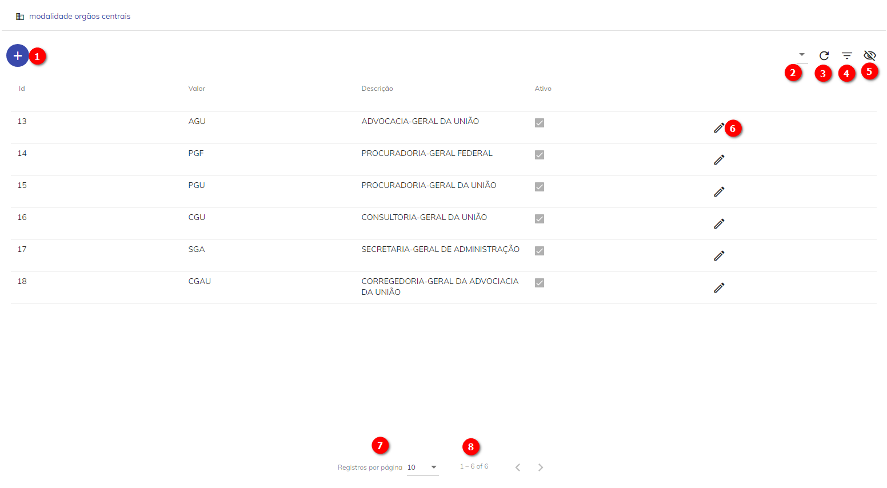

# Órgãos

O conceito de Órgão Central no Super.BR é o de aglutinador de Unidades (lembrando, Unidade é um concentrador de setores – ou equipes - que vão trabalhar de maneira coordenada), e se torna responsável pela gestão do conhecimento dessas Unidades, atuando em âmbito nacional. Dessa forma, temos o Órgão Central acima de várias Unidades e estas, por sua vez, acima dos setores.  

A liderança do Órgão Central está a cargo do Coordenador de Órgão Central (perfil concedido pelo Administrador do sistema). Naturalmente, já que há uma relação de hierarquia criada entre Órgão central, Unidades e Setores e, portanto, a relação de coordenadores dessas áreas segue da mesma forma: O Coordenador de Órgão Central ele está acima do Coordenador de Unidade e do Coordenador de Setor e por sua vez, consegue atuar nas atribuições dadas a eles.  

Acima de todos os tipos de acesso, temos o de Administrador do Sistema. Ele tem, dentre outras atribuições, ser responsável pela criação de um Órgão Central. A criação do Órgão Central será descrita a seguir e é a que permitirá desencadear outras ações. 


##Tela de Órgãos


Com o perfil de Administrador, a tela de Órgãos permite visualizar os Órgãos já cadastrados no Sistema, além de editar os já existentes. 

 

Figura 1 – Tela dos Órgãos Centrais


Seguem indicadores dos botões na Tela de Órgãos

1) Novo. Utilizado para criar um Órgão; 

2) Colunas. Por esta opção será possível gerenciar as colunas que serão disponibilizadas em tela; 

3) Recarregar. Opção permite a atualização dos registros apresentados em tela;  

4) Filtro. Opção possibilita filtrar um intervalo de dados com base em critérios definidos; 

5) Mostrar inativos. Opção habilita mostra de Aviso Ativos e Inativos; 

6) Editar o cadastro de um Órgão.
 

## Como Cadastrar um Órgão 

Com acesso de Administrador de sistema, acessar a lista de Órgãos Centrais e para criar, deve-se seguir a descrição abaixo:  


1. Clicar em  "Novo"  e preencher todos os campos que aparecerem na tela subsequente:  

```{note}
Nota: Todos os campos marcados com * são de preenchimento obrigatório. 
```


**Valor*:** Campo obrigatório, destinado ao preenchimento à Sigla do nome do Órgão; 

**Descrição*:** Campo obrigatório, destinado ao preenchimento do nome do Órgão; 

**Ativo:** A habilitação desse campo indicará que o Órgão está ativo;

2. Clicar em Salvar
