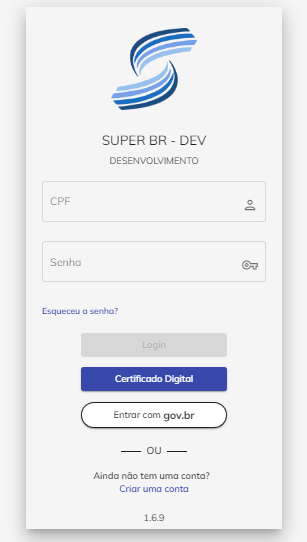
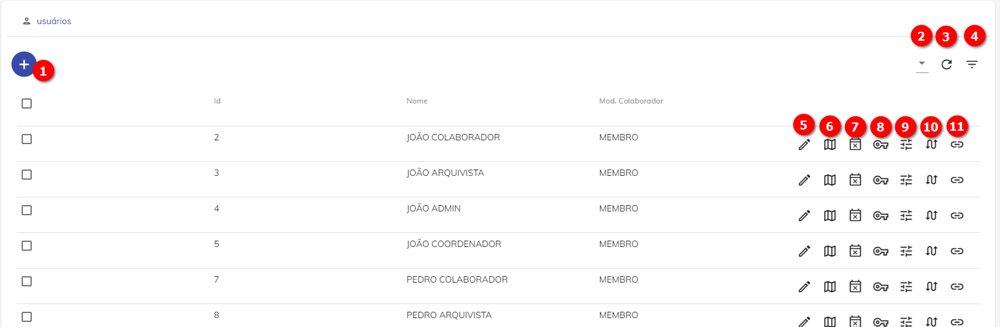
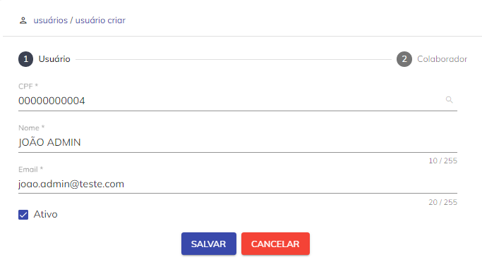
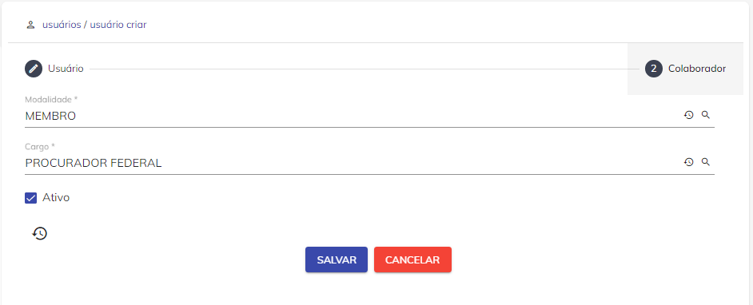

# Usuários


Definição de Usuário pode ser de uma pessoa que utiliza um Sistema de Informação (no caso, o Super.BR) ou a informação que ele produz. A permissão de uso do Super.BR é dada pelo Administrador do Sistema. 

O acesso e utilização do sistema é feita por meio de Login (CPF do Usuário) e uma senha. 





<p style="text-align: center;"> Figura 1 – Tela de Acesso do Usuário do Super.BR </p> 


A criação do Usuário, bem como a permissão de acesso e senha é concedida pelo Administrador do Super.BR, cujo procedimento será detalhado a seguir. É necessário também reforçar a importância de realizar o cadastro de [Pessoas](configuraçao/Pessoas.md) antes de realizar o cadastro de Usuário.
  


 </p> 
<p style="text-align: center;"> Figura 2 – Tela de Login SUPP</p> 

## Níveis de Acesso/Perfis e Privilégios 

Em sistemas operacionais multi-usuário, costuma-se utilizar a separação de privilégios. Cada usuário executa com seus privilégios específicos e pode executar apenas um número limitado de tarefas. Isso também ocorre no Super.BR, onde podemos ter os seguintes perfis, cada um com sua respectiva gama de responsabilidades e níveis de acesso. 

 

O sistema contempla 5 Níveis de Acesso, variando de 0 a 4, de acordo com a responsabilidade do Usuário: 

- **Nível 0:** Nenhum tipo de direito especial. Esse Nível de Acesso deve ser atribuído a Estagiários e Usuários Externos. O Usuário não será capaz de visualizar Processos/Documentos Avulsos que tenham qualquer tipo de Sigilo. 

 

- **Nível 1:** Sigilo Legal ou Comum. Esse Nível de Acesso permite visualizar e atribuir Sigilos do tipo Comum (Sigilo Legal, tais como Sigilo Bancário ou Fiscal). É o Nível de Acesso que deverá ser atribuído para Advogados e Servidores como regra geral. 

 

- **Nível 2:** Nível Reservado da Lei de Acesso à informação. Esse Nível de Acesso deverá ser atribuído para Servidores e Advogados que exerçam funções de direção, comando ou chefia do Grupo-Direção e Assessoramento Superiores - DAS, nível DAS 101.5 ou superior, e seus equivalentes. 

 

- **Nível 3:** Nível Secreto. Esse Nível de Acesso deverá ser atribuído aos titulares de autarquias, fundações, empresas públicas e sociedades de economia mista. 

 

- **Nível 4:** Nível Ultrassecreto. Esse Nível de Acesso deverá ser atribuído apenas ao Presidente da República, Vice-Presidente da República, Ministros de Estado e autoridades com as mesmas prerrogativas, e Comandantes da Marinha, do Exército, da Aeronáutica, Chefes de Missões Diplomáticas e Consulares permanentes no exterior.Atenção: a atribuição do Nível de Acesso é uma grande responsabilidade para o administrador, que deverá concedê-lo de acordo com a legislação, sob pena de responsabilidade. 

 

### Administrador do Super.BR 

Toda a unidade do SUPER.BR deve possuir um administrador, responsável pela gestão dos usuários, dos setores e seus Localizadores, bem como das Lotações. 

Para maiores informações sobre as funções do Administrador de Sistemas, clique aqui.
``` {warning}
Inserir Hyperlink após criação do manual do Administrador
```

### Coordenador de Unidade

Esse perfil possibilita a criação e gestão de modelos nacionais de documentos, bem como dos repositórios nacionais de conhecimento do SUPER.BR.  

Para maiores informações sobre as funções do Coordenador de Unidade, clique aqui. 
``` {warning}
Inserir Hyperlink após criação do manual do Coordenador de Unidade
```
 

### Coordenador de Setor 

Não é exatamente um perfil, mas sim um atributo da lotação. Cada setor deve ter ao menos um coordenador, responsável pela gestão dos modelos locais de documentos, dos repositórios locais de conhecimento e dos critérios de visibilidade dos processos/documentos avulsos.  

Para maiores informações sobre as funções do Coordenador de Setor, clique aqui. 
``` {warning}
Inserir Hyperlink após criação do manual do Coordenador de Setor
```
 

### Arquivista 

Todo setor de arquivo, de cada uma das unidades do SUPER.BR, deve possuir ao menos um usuário com perfil arquivista, responsável por fazer as transições arquivísticas dos processos/documentos avulsos (transferência, desarquivamento, etc.). 

Para maiores informações sobre as funções do Arquivista, clique aqui. 
```{warning}

Inserir Hyperlink após criação do manual do Arquivista
```
 

### Distribuidor 

Não é exatamente um perfil, mas sim um atributo da lotação. O papel do usuário distribuidor é centralizar o recebimento de tarefas oriundas de outras unidades ou setores, de modo a, posteriormente, efetuar a redistribuição internamente.  

Para maiores informações sobre as funções do Distribuidor, clique aqui. 
```{warning}
Inserir Hyperlink após criação do manual do Distribuidor
```
 

### Servidor 

Perfil para acesso dos servidores administrativos.  

Para maiores informações sobre as funções do Servidor, clique aqui. 
```Inserir Hyperlink após criação do manual do Servidor```
 

### Estagiário 

Perfil para acesso dos estagiários.  

Para maiores informações sobre as funções do Estagiário, clique aqui. 
``` {warning}
Inserir Hyperlink após criação do manual do Estagiário
```
 

### Usuário Externo 

Perfil para acesso dos Usuários Externos.  

Para maiores informações sobre as funções do Usuário Externo, clique aqui. 
``` {warning}
Inserir Hyperlink após criação do manual do Usuário Externo
```
 
```{note}
Nota: Nível de Acesso e Perfil de Usuário são conceitos diferentes:  O primeiro é relacionado a possibilidade de acesso à informação. O segundo é voltado a responsabilidade dentro do sistema.  
```
 

## Tela Usuários

Com o perfil de Administrador, a tela Usuários permite visualizar os Usuários cadastrados no Sistema, além de configurar características e executar comandos de gestão. 

 




<p style="text-align: center;">Figura 3 – Tela de Usuários SUPP</p> 

 

 

Seguem indicadores dos botões na Tela de Usuários (Figura 3): 

1) Criar um registro de novo Usuário 

2) Colunas. Por esta opção será possível gerenciar as colunas que serão disponibilizadas na tela; 

3) Recarregar. Opção permite a atualização dos registros apresentados em tela;  

4) Filtro. Opção possibilita filtrar um intervalo de dados com base em critérios definidos. 

5) Editar o cadastro de um Usuário 

6) Lotações. Opção permite abrir a tela de Lotações de Usuários dentro dos Setores. Maiores detalhes no documento de [Setores](configuraçao/Setor.md)

7) Afastamentos. Opção permite abrir a tela de Afastamento de Usuários. 

8) Reseta Senha. Opção permite resetar a senha do Usuário para o Super.BR 

9) Coordenações. Opção permite abrir a tela de Coordenadores de Usuários. 

10) Distribuir Tarefas. Opção permite abrir a tela de Coordenadores de Usuários. 

11) Vincular Role. Opção permite abrir a tela de Roles.

12) Opção permite configurar a quantidade de registros a serem mostrados em tela.

13) Tarja indica a quantidade de páginas relacionadas a consulta em tela. A navegação entre as páginas poderá ser feita por meio do uso das setas disponíveis.

 

## Como Criar um novo USUÁRIO no Super.BR 

Antes da criação de um novo Usuário, é preciso fazer a criação de Pessoas. Para isso, o procedimento se encontra neste [link](configuraçao/Pessoas.md).

Feito isso, para criar um novo usuário, o Administrador de Sistemas deve seguir os seguintes passos:  

01\. Acessar o menu de Usuários e clicar no botão “Novo”  localizado na parte superior esquerda da tela; 


02\. Em seguida, deverá preencher os campos disponíveis no formulário com as informações referentes ao Usuário a ser cadastrado; 

```{note}
Nota: Todos os campos marcados com * são de preenchimento obrigatório. 
```

**CPF:** Campo obrigatório, destinado ao preenchimento do número do CPF do Usuário. Esse campo servirá de identificação “user” para acesso ao Super.BR. Após preencher os 11 caracteres do CPF (sem traços ou pontos), o sistema irá trazer novos campos a serem preenchidos em duas telas: 

 

- Tela de Usuário:



<p style="text-align: center;"> Figura 4 – Tela de Formulário do Usuário do Super.BR </p> 

**Nome:** Campo obrigatório, destinado ao preenchimento do nome do Usuário;  

**Email:** Campo obrigatório, destinado à indicação do e-mail do Usuário. 

**Ativo:** Flag que indica se o registro do Usuário está Ativo ou Inativo. Usuário Ativo é aquele que continua exercendo as suas funções dentro do órgão.


03\. Após salvar os campos preenchidos, um novo campo é habilitado:  

**Nível de Acesso:** Campo Opcional, numérico (de 0 a 4) que mostra o nível de Acesso que o Usuário criado poderá ter de privilégios, conforme descrito na seção Nível de Acesso.

```{warning}
Erro: O Super.BR apresenta números negativos para esses níveis de acesso
```


04\. Após salvar novamente, a Tela de Colaborador é habilitada com novos campos:  



<p style="text-align: center;"> Figura 5 – Tela do Formulário do Colaborador do Super.BR </p> 


**Modalidade:** Campo obrigatório, destinado à modalidade que o usuário lhe é atribuída (Membro, Servidor, Estagiário, Terceirizado); 

**Cargo:** Campo obrigatório, destinado ao Cargo que o Usuário possui dentro do Órgão. 

O flag Ativo também está disponível para seleção.


Pronto, o novo Usuário está criado. Após esse cadastro, está habilitado a seguir os próximos passos da Configuração Inicial do Super.BR.

É sugerido continuar com a criação de Lotações (que é um segmento do documento inserido em [Setores](configuraçao/Setor.md).