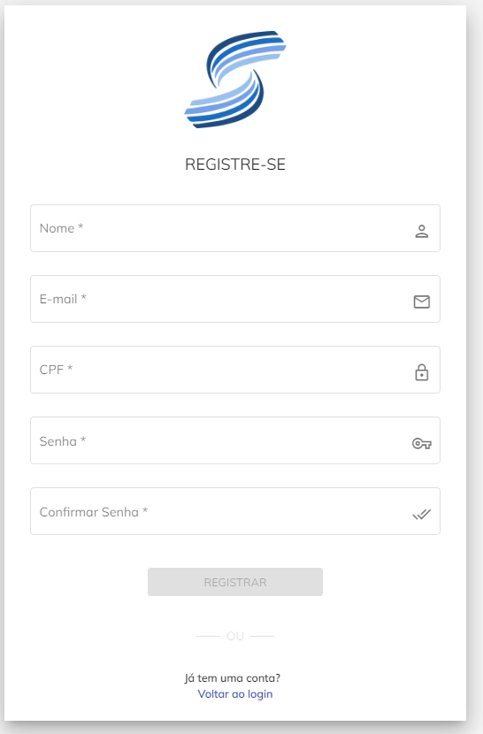
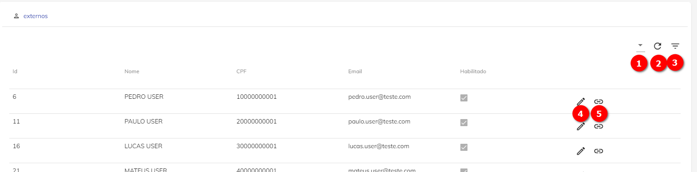

# Usuários Externos

O Usuário Externo é um usuário fora do domínio do Órgão, mas que possui interações com o Órgão e precisam ter funções (ainda que limitadas) dentro do Super.BR.

Para informações detalhadas sobre o Usuário não-Externo (ou Usuário ou Usuário Comum), [clique aqui](configuraçao/Usuários.md). 


## Criação de Usuário Externo

A criação de um Usuário Externo deve seguir os seguintes passos:


1\. Acessar [o site do Super.BR](configuraçao/https://superbr-dev.dth.nuvem.gov.br/auth/login)  

```{warning}
Verificar a atualização do link: 
```


2\. Clicar no “Criar uma conta”; 

3\. Preencher todos os campos requeridos:



<p style="text-align: center;"> Figura 1 – Tela de Formulário de Usuários Externos</p>


**Nome:** Campo obrigatório, destinado ao preenchimento do nome do Usuário Externo; 

**E-mail:** Campo obrigatório, destinado ao preenchimento do e-mail do Usuário Externo; 

```Sugestão de novo campo: "Confirmar Email"```

**CPF:** Campo obrigatório, destinado ao preenchimento do CPF do Usuário Externo. Essa informação será utilizada como identificação do usuário ao acesso no Super.BR 

**Senha:** Campo obrigatório, destinado ao preenchimento da Senha do Usuário Externo. 

**Confirmar Senha:** Campo obrigatório, destinado à confirmação do preenchimento da Senha do Usuário Externo. 

 

4\. O Usuário Externo irá receber um e-mail de confirmação de cadastro pelo e-mail fornecido no campo preenchido. 


Pronto, o Usuário Externo está criado.
O Administrador do Super.BR já poderá acessar, editar e limitar as concessões que o Usuário Externo poderá exercer dentro do Super.BR, como se pode verificar adiante.
 
## Tela de Usuário Externo

Após a criação do Usuário Externo, o Administrador do Sistema poderá ter acesso à tela de Usuários Externos criados e realizar comandos de gestão. 




<p style="text-align: center;"> Figura 2 – Tela de Usuários Externos Cadastrados no Super.BR</p>


Seguem indicadores dos botões na Tela de Usuários (Figura 2):

1) Colunas. Por esta opção será possível gerenciar as colunas que serão disponibilizadas na tela; 

2) Recarregar. Opção permite a atualização dos registros apresentados em tela;  

3) Filtro. Opção possibilita filtrar um intervalo de dados com base em critérios definidos. 

4) Editar o cadastro de um Usuário Externo 

5) Vincular Pessoa. Opção permite abrir a tela de vincular pessoa. Para o cadastro de uma pessoa, deve seguir os procedimentos por meio do [link](configuraçao/Pessoas.md).

6) Opção permite configurar a quantidade de registros a serem mostrados em tela.

7) Tarja indica a quantidade de páginas relacionadas a consulta em tela. A navegação entre as páginas poderá ser feita por meio do uso das setas disponíveis.


 

O Administrador de Sistema, para editar as informações do Usuário Externo poderá conter além dos dados básicos, os seguintes campos:  

**Nível de Acesso:** Campo opcional que determina o tipo de acesso que aquele Usuário Externo pode ter; 

**Ativo:** Flag que indica se o Usuário Externo está Ativo ou Inativo. 
Usuário Externo Ativo indica se este continua exercendo suas funções.

**Validado:** Flag que indica se o Usuário Externo foi validado.


